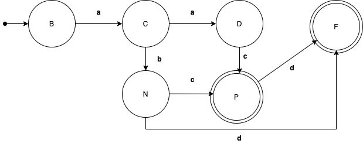

# Non-deterministic Finite Automaton (NFA)

Design a NFA to recognize the following sets of strings: abc, abd, and aacd. Suppose the alphabet is {a, b, c, d}.

## Requirements

[Python 3](https://www.python.org/downloads/) 

[Graphviz](https://graphviz.org/)

[Virtual environment](https://pypi.org/project/virtualenv/)

## How to run?

1. You need to create a [virtual environment](https://pypi.org/project/virtualenv/) for python

```shell
virtualenv venv 
```
2. You need to activate the virtual environment

> MacOs/Linux

```shell
source venv/bin/activate
```
> Windows
```cmd
.\venv\Scripts\activate
```

3. install dependencies 

```shell
pip install -r requirements.txt
```
4. Run the script 

```shell
python ./src/main.py
```

## Representation of the automaton

### Data

- Q = {q0, q1, q2, q3, q4}
- ∑ = {a, b, c, d}
- s = q0
- F = {q4}
- δ = {
(q0,a,q1), 
(q0,b,∅), 
(q0,c,∅), 
(q0,d,∅), 
(q1,a,q2), 
(q1,b,{q2,q3}), 
(q1,c,∅), 
(q1,d,∅), 
(q2,a,∅), 
(q2,b,∅), 
(q2,c,{q3,q4}), 
(q2,d,∅), 
(q3,a,∅), 
(q3,b,∅), 
(q3,c,∅), 
(q3,d,q4), 
(q4,a,∅), 
(q4,b,∅), 
(q4,c,∅), 
(q4,d,∅), 
}

### Graph


### Transition table
|            | a           | b           | c          | d          |
| ---------- | ----------- | ----------- | ---------- | ---------- |
| →  q0      | q1          | ∅           | ∅          | ∅          |
|    q1      | q2          | {q2, q3}    | ∅          | ∅          |
|    q2      | ∅           | ∅           | {q3, * q4} | ∅          |
|    q3      | ∅           | ∅           | ∅          | * q4       |
| *  q4      | ∅           | ∅           | ∅          | ∅          |

## Equivalence of NFA to DFA

### Subsets

|                    | a           | b           | c          | d          |
| ------------------ | ----------- | ----------- | ---------- | ---------- |
|   ∅                | ∅           | ∅           | ∅          | ∅          |
|   {q0}             | q1          | ∅           | ∅          | ∅          |
|   {q1}             | q2          | {q2,q3}     | ∅          | ∅          |
|   {q2}             | ∅           | ∅           | {q3,q4}    | ∅          |
|   {q3}             | ∅           | ∅           | ∅          | q4         |
|   {q4}             | ∅           | ∅           | ∅          | ∅          |
|   {q0,q1}          | {q1,q2}     | {q2,q3}     | ∅          | ∅          |
|   {q0,q2}          | q1          | ∅           | {q3,q4}    | ∅          |
|   {q0,q3}          | q1          | ∅           | ∅          | q4         |
|   {q0,q4}          | q1          | ∅           | ∅          | ∅          |
|   {q1,q2}          | q2          | {q2,q3}     | {q3,q4}    | ∅          |
|   {q1,q3}          | q2          | {q2,q3}     | ∅          | q4         |
|   {q1,q4}          | q2          | {q2,q3}     | ∅          | ∅          |
|   {q2,q3}          | ∅           | ∅           | {q3,q4}    | q4         |
|   {q2,q4}          | ∅           | ∅           | {q3,q4}    | ∅          |
|   {q3,q4}          | ∅           | ∅           | ∅          | q4         |
|   {q0,q1,q2}       | {q1,q2}     | {q2,q3}     | {q3,q4}    | ∅          |
|   {q0,q1,q3}       | {q1,q2}     | {q2,q3}     | ∅          | q4         |
|   {q0,q1,q4}       | {q1,q2}     | {q2,q3}     | ∅          | ∅          |
|   {q0,q2,q3}       | q1          | ∅           | {q3,q4}    | q4         |
|   {q0,q2,q4}       | q1          | ∅           | {q3,q4}    | ∅          |
|   {q0,q3,q4}       | q1          | ∅           | ∅          | q4         |
|   {q1,q2,q3}       | q2          | {q2,q3}     | {q3,q4}    | q4         |
|   {q1,q2,q4}       | q2          | {q2,q3}     | {q3,q4}    | ∅          |
|   {q1,q3,q4}       | q2          | {q2,q3}     | ∅          | ∅          |
|   {q2,q3,q4}       | ∅           | ∅           | {q3,q4}    | q4         |
|   {q0,q1,q2,q3}    | {q1,q2}     | {q2,q3}     | {q3,q4}    | q4         |
|   {q0,q1,q2,q4}    | {q1,q2}     | {q2,q3}     | {q3,q4}    | ∅          |
|   {q0,q1,q3,q4}    | {q1,q2}     | {q2,q3}     | ∅          | q4         |
|   {q0,q2,q3,q4}    | q1          | ∅           | {q3,q4}    | q4         |
|   {q1,q2,q3,q4}    | q2          | {q2,q3}     | {q3,q4}    | q4         |
|   {q0,q1,q2,q3,q4} | {q1,q2}     | {q2,q3}     | {q3,q4     | q4         |

## Rename Subsets
|      | a    | b    | c    | d    |
| ---- | ---- | ---- | ---- | ---- |
| A    | A    | A    | A    | A    |
| → B  | C    | A    | A    | A    |
| C    | D    | N    | A    | A    |
| D    | A    | A    | P    | A    |
| E    | A    | A    | A    | F    |
| F    | A    | A    | A    | A    |
| G    | K    | N    | A    | A    |
| H    | C    | A    | P    | A    |
| I    | C    | A    | A    | F    |
| J    | C    | A    | A    | A    |
| K    | D    | N    | P    | A    |
| L    | D    | N    | A    | F    |
| M    | D    | N    | A    | A    |
| N    | A    | A    | P    | F    |
| O    | A    | A    | P    | A    |
| P    | A    | A    | A    | F    |
| Q    | K    | N    | P    | A    |
| R    | K    | N    | A    | F    |
| S    | K    | N    | A    | A    |
| T    | C    | A    | P    | F    |
| U    | C    | A    | P    | A    |
| V    | C    | A    | A    | F    |
| W    | C    | N    | P    | F    |
| X    | D    | N    | P    | A    |
| Y    | D    | N    | A    | A    |
| Z    | A    | A    | P    | F    |
| AA   | K    | N    | P    | F    |
| AB   | K    | N    | P    | A    |
| AC   | K    | N    | A    | F    |
| AD   | C    | A    | P    | F    |
| AE   | D    | N    | P    | F    |
| AF   | K    | N    | P    | F    |

## Remove unused subsets

|      | a    | b    | c    | d    |
| ---- | ---- | ---- | ---- | ---- |
| A    | A    | A    | A    | A    |
| → B  | C    | A    | A    | A    |
| C    | D    | N    | A    | A    |
| D    | A    | A    | P    | A    |
| *  F | A    | A    | A    | A    |
| N    | A    | A    | * P  | * F  |
| * P  | A    | A    | A    | * F  |

## Graph


